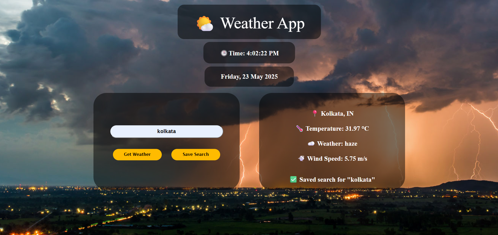

# 🌦️ What's The Weather?

A simple and elegant weather web app built using **HTML**, **CSS**, and **JavaScript** that lets you check the **current and 5-day weather forecast** of any location in real-time. Weather data is fetched using the [Open Weather 13 API](https://rapidapi.com/matheuslteles/api/open-weather13) via **RapidAPI**.

---

## 🔗 Live Demo

[🚀 View Website](https://your-deployed-url.com)  
*(Replace this with your live hosted URL)*

---

## 📸 Screenshots

<!-- Add screenshots of your website here if available -->



---

## 🛠️ Tech Stack

| Frontend | API | Hosting |
|----------|-----|---------|
| HTML     | Open Weather 13 (RapidAPI) | GitHub Pages / Netlify |
| CSS      |                         |
| JavaScript |

---

## 🔍 Features

- 🌍 Search weather by city name
- 🌡️ Get current temperature, humidity, wind speed, and condition
- 🎨 Responsive and clean UI
- ☁️ Real-time data using **RapidAPI**

---

## 🚀 How to Run Locally

1. **Clone the repository**
```bash
git clone https://github.com/your-username/whats-the-weather.git
cd whats-the-weather
